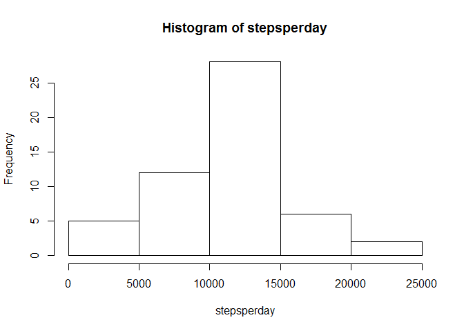
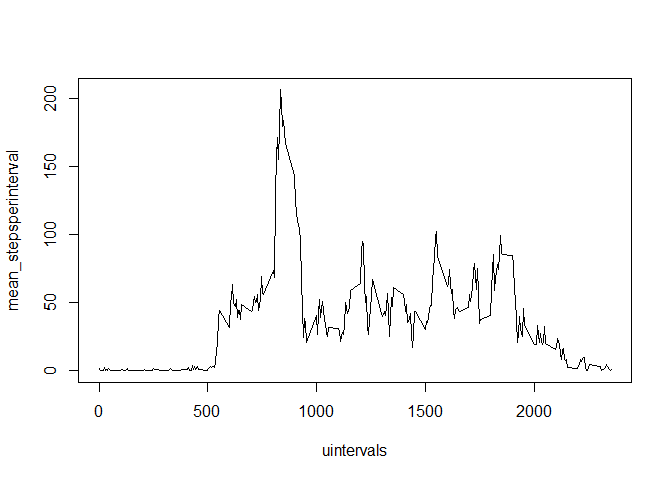
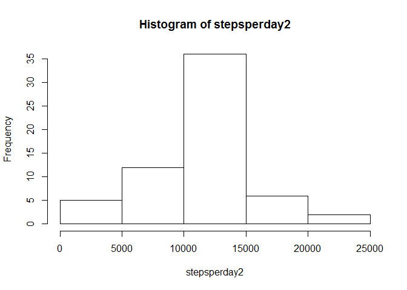
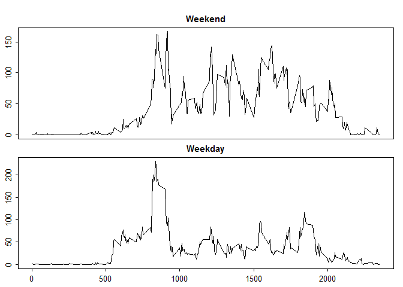

## Loading and preprocessing the data

```r
data <- read.csv("activity.csv")
steps <- data$step
dates <- as.character(data$date)
intervals <-data$interval
```

## What is mean total number of steps taken per day?  
Calculate the total number of steps by day  

```r
udates <- unique(dates)
stepsperday <- 0
for (i in 1:length(udates)) {
    stepsperday[i] <- sum(steps[dates == udates[i]])
}
hist(stepsperday)
```

 

```r
filtr <- is.na(stepsperday)
meansteps <- as.character(mean(stepsperday[!filtr]))
mediansteps <-as.character(median(stepsperday[!filtr]))
```
The daily mean steps is 10766.1886792453, and the median is 10765. 

## What is the average daily activity pattern?

```r
uintervals <- unique(data$interval)
mean_stepsperinterval <- 0
for (i in 1:length(uintervals)) {
    stepsperinterval <- steps[intervals == uintervals[i]]
    filt <- is.na(stepsperinterval)
    mean_stepsperinterval[i] <- mean(stepsperinterval[!filt])
}
plot(uintervals,mean_stepsperinterval,type = "l")
```

 

```r
max_step_int_pos <- which.max(mean_stepsperinterval)
max_step_int <- mean_stepsperinterval[max_step_int_pos]
```
The interval with a greater number of average steps is interval 104, having 206.1698113 steps.  

## Imputing missing values

```r
mis_val <- sum(is.na(data[,1]))
data2 <- data
a<-0
cont <- 0
for (i in 1:length(dates)){
    if (is.na(steps[i])) {
        cont <- cont +1
        ind <- match(intervals[i],uintervals)
        a[cont] <- ind
        data2[i,1] <- mean_stepsperinterval[ind]
    }
}
steps2 <- data2$steps
stepsperday2 <- 0
for (i in 1:length(udates)) {
    stepsperday2[i] <- sum(steps2[dates == udates[i]])
}
hist(stepsperday2)
```

 

```r
filtr <- is.na(stepsperday)
meansteps2 <- as.character(mean(stepsperday2[!filtr]))
mediansteps2 <-as.character(median(stepsperday2[!filtr]))
```
The total number of missing values is 2304.  
The new daily mean steps is 10766.1886792453, and the median is 10765. 

## Are there differences in activity patterns between weekdays and weekends?

```r
for (i in 1:length(steps2)){
    dia <- weekdays(as.Date(dates[i]))
    if (dia =="lunes") {data2[i,4] <- "weekday"}
    else if (dia=="martes") {data2[i,4] <- "weekday"}
    else if (dia=="miércoles") {data2[i,4] <- "weekday"}
    else if (dia=="jueves") {data2[i,4] <- "weekday"}
    else if (dia=="viernes") {data2[i,4] <- "weekday"}
    else if (dia=="sábado") {data2[i,4] <- "weekend"}
    else if (dia=="domingo") {data2[i,4] <- "weekend"}
    }
cn <- colnames(data2)
cn[4] <- "daytype"
colnames(data2) <- cn
mean_spi_wd <- 0
mean_spi_we <- 0
for (i in 1:length(uintervals)) {
    spi_wd <- data2[data2[,3] == uintervals[i] & data2[,4] == "weekday",]
    spi_we <- data2[data2[,3] == uintervals[i] & data2[,4] == "weekend",]
    mean_spi_wd[i] <- mean(spi_wd$steps)
    mean_spi_we[i] <- mean(spi_we$steps)
}
par(mfrow=c(2,1))
par(cex = 0.8)
par(mar = c(0,0,2,0), oma =  c(2, 2, 1, 1))
par(tcl = -0.25)
par(mgp = c(2, 0.6, 0))

plot(uintervals,mean_spi_we,type = 'l', main="Weekend", xaxt='n')
plot(uintervals,mean_spi_wd,type = 'l', main="Weekday")
```

 
